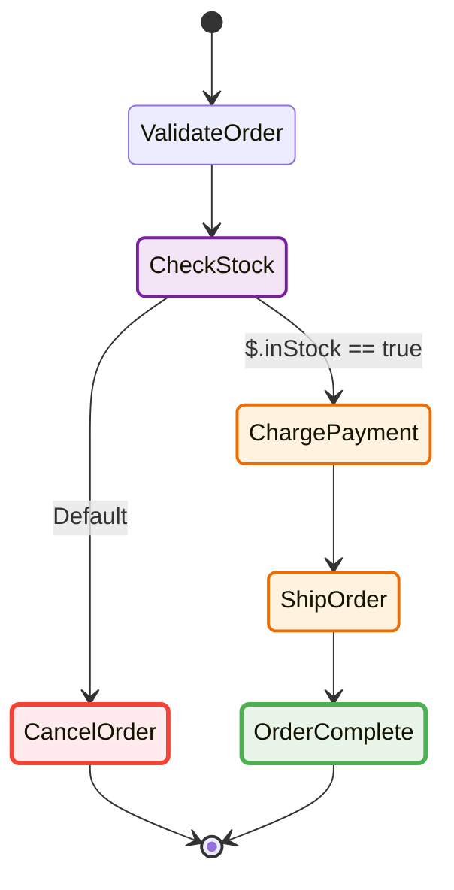
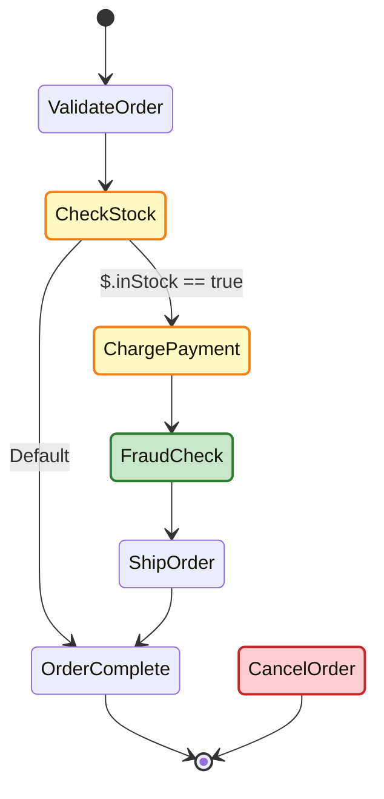

# sfn-diagram

[](https://www.npmjs.com/package/sfn-diagram)
[](https://opensource.org/licenses/MIT)
[](https://yusufaf.github.io/sfn-diagram/)

Generate beautiful, interactive diagrams from AWS Step Functions ASL (Amazon States Language) definitions. Supports dual output formats: D3.js-based SVG and Mermaid.js diagram code, plus PNG export.

**▶ [Try it in the live playground](https://yusufaf.github.io/sfn-diagram/)** — paste any ASL definition and preview the diagram instantly, no install required.

## What it looks like

Give it an ASL definition like this order-processing workflow ([`examples/order-processing.asl.json`](examples/order-processing.asl.json)):

```jsonc
{
  "StartAt": "ValidateOrder",
  "States": {
    "ValidateOrder": { "Type": "Pass", "Next": "CheckStock" },
    "CheckStock": {
      "Type": "Choice",
      "Choices": [{ "Variable": "$.inStock", "BooleanEquals": true, "Next": "ChargePayment" }],
      "Default": "CancelOrder"
    },
    "ChargePayment": { "Type": "Task", "Resource": "arn:aws:lambda:...:charge-payment", "Next": "ShipOrder" },
    "ShipOrder":     { "Type": "Task", "Resource": "arn:aws:lambda:...:ship-order", "Next": "OrderComplete" },
    "CancelOrder":   { "Type": "Fail", "Error": "OutOfStock" },
    "OrderComplete": { "Type": "Succeed" }
  }
}
```

…and `generateMermaid` turns it into a diagram GitHub renders inline (the same code also drives SVG and PNG output):



## Features

- **Multiple Output Formats**: SVG (D3.js), Mermaid syntax, and PNG
- **Automatic Layout**: Smart graph positioning using Dagre layout engine
- **Full ASL Support**: All state types (Pass, Task, Choice, Wait, Succeed, Fail, Parallel, Map), both JSONPath and JSONata query languages, plus `Catch`/`Retry` rendering
- **Visual Diffing**: Compare two definitions and highlight added / modified / removed states — drives the PR-preview GitHub Action
- **Execution Overlays**: Paint a real execution's history onto the diagram — succeeded/failed/caught/not-reached states, the taken path, and per-state duration & retry counts
- **Customizable Themes**: AWS light/dark themes plus custom theme support
- **Flexible Layouts**: Top-bottom, left-right, right-left, bottom-top
- **Type-Safe**: Full TypeScript support with comprehensive type definitions
- **AWS SDK Integration**: Direct integration with AWS Step Functions API
- **Dual APIs**: Function-based and class-based interfaces
- **Runs Anywhere**: SVG and Mermaid generation has zero platform dependencies — works in Node, the browser, and edge runtimes

## Installation

```bash
npm install sfn-diagram
```

The core package pulls in **no browser engine** — SVG and Mermaid generation stay lightweight. PNG export relies on a headless browser, provided by the optional peer dependency `node-html-to-image`. Install it only if you use `sfn-diagram/png`:

```bash
npm install sfn-diagram node-html-to-image
```

## Runtime Support

The core entry (`sfn-diagram`) builds SVG with a DOM-free string renderer, so
`generateSvg`, `generateMermaid`, `generateDiagram`, and `generateFromAwsResponse`
run in **Node, browsers, and edge runtimes** (Cloudflare Workers, Vercel Edge, Deno, Bun)
with no DOM polyfill.

PNG export (`sfn-diagram/png`) and the CLI are **Node-only** — they rely on a headless
browser (`node-html-to-image`) and Node's filesystem respectively. Because `node-html-to-image`
is an **optional peer dependency**, install it alongside `sfn-diagram` when you need PNG output;
`exportPng` throws an actionable error if it is missing.

```ts
// Works in Node, browser, and edge:
import { generateSvg } from 'sfn-diagram';

// Node-only:
import { exportPng } from 'sfn-diagram/png';
```

## Command-line Usage

The package ships a CLI for use without writing any JavaScript:

```bash
npx sfn-diagram state.asl.json --format svg -o diagram.svg
npx sfn-diagram state.asl.json --format mermaid > diagram.mmd
cat state.asl.json | npx sfn-diagram - --format svg
```

Flags: `--format <svg|mermaid|png|html>`, `-o/--output <path>`, `--theme <light|dark>`, `--layout <TB|LR|RL|BT>`, `--hide-catch`, `-h/--help`, `-v/--version`.

> **`--format png` needs the optional `node-html-to-image` peer.** It is not installed by default. With `npx`, run `npx --package sfn-diagram --package node-html-to-image sfn-diagram …`; in a project, `npm install node-html-to-image`. Without it the CLI exits with an actionable error. Or skip the install entirely with the [Docker image](#docker), which bundles Chromium.

## Docker

A prebuilt image is published to GitHub Container Registry with Chromium baked in, so PNG export works out of the box:

```bash
docker run --rm -v "$PWD":/work ghcr.io/yusufaf/sfn-diagram:latest \
  /work/state.asl.json --format svg -o /work/diagram.svg

docker run --rm -v "$PWD":/work ghcr.io/yusufaf/sfn-diagram:latest \
  /work/state.asl.json --format png -o /work/diagram.png
```

Tags: `latest`, `<major>`, `<major>.<minor>`, `<major>.<minor>.<patch>`.

## Quick Start

### Function-based API

```typescript
import { generateSvg } from 'sfn-diagram';
import { writeFileSync } from 'fs';

const asl = {
  StartAt: 'HelloWorld',
  States: {
    HelloWorld: {
      Type: 'Pass',
      Result: 'Hello, World!',
      End: true
    }
  }
};

const { svg, width, height } = generateSvg({
  aslDefinition: asl,
  theme: 'dark',
  layout: 'LR'
});

writeFileSync('diagram.svg', svg);
console.log(`Generated ${width}x${height} diagram`);
```

### Class-based API

```typescript
import { SfnDiagramGenerator } from 'sfn-diagram';

const generator = new SfnDiagramGenerator({
  theme: 'dark',
  layout: 'TB',
  nodeWidth: 150,
  nodeHeight: 80,
});

const { svg } = generator.generateSvg({ aslDefinition: asl });
const { code } = generator.generateMermaid({ aslDefinition: asl });
```

## API Reference

### generateSvg(params)

Generate an SVG diagram using D3.js and Dagre layout.

```typescript
import { generateSvg } from 'sfn-diagram';

const result = generateSvg({
  aslDefinition: asl,              // ASL definition (object or JSON string)
  theme: 'light',                  // 'light', 'dark', or CustomTheme object
  layout: 'TB',                    // 'TB', 'LR', 'RL', 'BT'
  nodeWidth: 120,                  // Node width in pixels
  nodeHeight: 60,                  // Node height in pixels
  rankSeparation: 50,              // Vertical spacing between ranks
  nodeSeparation: 50,              // Horizontal spacing between nodes
  padding: 20,                     // Diagram padding
  edgeStyle: 'curved',             // 'curved', 'straight', 'orthogonal'
  showStateTypes: false,           // Display state types on nodes
  includeComments: true,           // Use state comments as labels
  customColors: {}                 // Override colors for specific states
});

// Returns SvgOutput: { svg: string, width: number, height: number, metadata: { edgeCount: number, nodeCount: number } }
```

### generateMermaid(params)

Generate Mermaid.js diagram syntax.

```typescript
import { generateMermaid } from 'sfn-diagram';

const result = generateMermaid({
  aslDefinition: asl,
  includeComments: true
});

// Returns MermaidOutput: { code: string, metadata: { edgeCount: number, stateCount: number } }
```

### generateDiagram(params)

Generate a diagram, choosing the output format via the `format` option (defaults to `'svg'`).

```typescript
import { generateDiagram } from 'sfn-diagram';

const svgResult = generateDiagram({
  aslDefinition: asl,
  theme: 'dark'
});                                // Returns SvgOutput

const mermaidResult = generateDiagram({
  aslDefinition: asl,
  format: 'mermaid'
});                                // Returns MermaidOutput
```

### exportPng(params)

Export diagram as PNG image. Node-only — imported from the `sfn-diagram/png` subpath.

```typescript
import { exportPng } from 'sfn-diagram/png';

const result = await exportPng({
  aslDefinition: asl,
  theme: 'light',
  pngQuality: 90,               // 1–100 (default 90)
  backgroundColor: 'transparent'
});

// Returns PngOutput: { buffer: Buffer, width: number, height: number, metadata: { format: 'png' } }
writeFileSync('diagram.png', result.buffer);
```

### generateFromAwsResponse(params)

Generate diagram directly from AWS SDK response.

```typescript
import { SFNClient, DescribeStateMachineCommand } from '@aws-sdk/client-sfn';
import { generateFromAwsResponse } from 'sfn-diagram';

const client = new SFNClient({ region: 'us-east-1' });
const response = await client.send(
  new DescribeStateMachineCommand({
    stateMachineArn: 'arn:aws:states:us-east-1:123456789012:stateMachine:MyStateMachine'
  })
);

const { svg } = generateFromAwsResponse({
  response,
  theme: 'dark'
});
```

### generateMermaidDiff(params) / generateDiff(params)

Compare two ASL definitions and highlight what changed. `generateMermaidDiff` returns Mermaid code (renders inline on GitHub); `generateDiff` returns the same comparison as an SVG. Added states are green, modified yellow, removed red — and both return a `metadata` change summary (`added`, `modified`, `removed`, `unchanged`). The comparison is order-insensitive, so reordering a state's properties is **not** flagged as a change.

```typescript
import { generateMermaidDiff } from 'sfn-diagram';

const { code, metadata } = generateMermaidDiff({
  before: baseAsl, // old (base) ASL definition, object or JSON string
  after: headAsl,  // new (head) ASL definition, object or JSON string
});

metadata; // { added: [...], modified: [...], removed: [...], unchanged: [...], stateCount, edgeCount }
```

For the order-processing workflow above, adding a `FraudCheck` step, bumping `ChargePayment`'s resource, and dropping `CancelOrder` renders like this:



> This is exactly what the [GitHub Action](#github-action) posts on pull requests that touch ASL files.

### generateExecution(params) / generateMermaidExecution(params)

Overlay a **real execution** onto the diagram. Where the diff shows how a definition
_changed_, the execution overlay shows what one _run_ actually did: which path it took,
which states succeeded (green), failed (red), were caught and recovered (orange), or were
never reached (grey) — plus per-state duration and retry counts.

Pass the ASL definition plus the execution's history. `history` accepts the events array
from `GetExecutionHistory`, the raw command output, or a JSON string of either — so the
core stays credential-free and runs in the browser.

```typescript
import { generateExecution, generateMermaidExecution } from 'sfn-diagram';

// history: events from `aws stepfunctions get-execution-history`, or the SDK response
const { svg, metadata } = generateExecution({ aslDefinition: asl, history });

metadata;
// { succeeded: [...], failed: [...], caught: [...], notReached: [...], running: [...],
//   takenEdgeCount, executionStatus, nodeCount, edgeCount }

// Mermaid variant (states coloured + duration/retry annotations in labels):
const { code } = generateMermaidExecution({ aslDefinition: asl, history });
```

> **Note:** Mermaid `stateDiagram-v2` cannot style individual transitions, so taken-path
> emphasis in Mermaid is expressed through node colours and label annotations. The SVG
> overlay additionally dims the transitions the run did not take.

Need just the data (no rendering)? `parseExecutionHistory({ events })` returns the pure
`ExecutionOverlay` model — per-state status, attempts, duration, and the taken edges — for
building your own UI.

```typescript
import { parseExecutionHistory } from 'sfn-diagram';

const overlay = parseExecutionHistory({ events });
overlay.states['ProcessOrder']; // { status: 'succeeded', attempts: 1, durationMs: 1250 }
overlay.takenEdges;             // [{ from: 'ValidateOrder', to: 'ProcessOrder' }, ...]
```

Fetching history from AWS (Node) — use the `sfn-diagram/aws` helper, which paginates `GetExecutionHistory` for you:

```typescript
import { SFNClient } from '@aws-sdk/client-sfn';
import { fetchExecutionHistory } from 'sfn-diagram/aws';

const client = new SFNClient({ region: 'us-east-1' });
const events = await fetchExecutionHistory({ client, executionArn });

const { svg } = generateExecution({ aslDefinition: asl, history: events });
```

`sfn-diagram/aws` is a Node-only subpath. `@aws-sdk/client-sfn` is an **optional peer dependency** — install it yourself (`npm i @aws-sdk/client-sfn`); the core `sfn-diagram` package stays dependency-free and browser-safe.

<details>
<summary>Prefer to paginate yourself? The manual loop:</summary>

```typescript
import { SFNClient, GetExecutionHistoryCommand } from '@aws-sdk/client-sfn';

const client = new SFNClient({ region: 'us-east-1' });
const events = [];
let nextToken;
do {
  const page = await client.send(
    new GetExecutionHistoryCommand({ executionArn, nextToken, maxResults: 1000 }),
  );
  events.push(...(page.events ?? []));
  nextToken = page.nextToken;
} while (nextToken);

const { svg } = generateExecution({ aslDefinition: asl, history: events });
```
</details>

### SfnDiagramGenerator Class

Reusable generator that holds diagram options once and applies them to every call. Configure options via the constructor or the fluent `setOptions()` method; pass the `aslDefinition` per generation.

```typescript
import { SfnDiagramGenerator } from 'sfn-diagram';

const generator = new SfnDiagramGenerator({
  theme: 'dark',
  layout: 'LR',
  nodeWidth: 150,
  nodeHeight: 80,
  rankSeparation: 60,
  nodeSeparation: 60,
  edgeStyle: 'curved',
  padding: 30,
});

// Update options later (chainable)
generator.setOptions({ theme: 'light' });

// Generate outputs (aslDefinition passed per call)
const svgResult = generator.generateSvg({ aslDefinition: asl });
const mermaidResult = generator.generateMermaid({ aslDefinition: asl });
```

> PNG export is a standalone function from `sfn-diagram/png` (`exportPng`), not a method on this class.

## Configuration Options

### Themes

**Built-in themes:**
- `'light'` - AWS light theme (default)
- `'dark'` - AWS dark theme

**Custom theme:**

A `CustomTheme` sets the background, per-state-type fill/stroke colours, edge colours, and typography. Pass it anywhere a theme is accepted.

```typescript
import type { CustomTheme } from 'sfn-diagram';

const customTheme: CustomTheme = {
  background: '#ffffff',
  edgeColors: {
    choice: '#7b1fa2',
    default: '#607d8b',
    error: '#f44336',
    normal: '#232f3e',
    retry: '#f9a825', // optional; falls back to `error` when omitted
  },
  fontFamily: 'Arial, sans-serif',
  fontSize: 14,
  nodeColors: {
    Pass:     { fill: '#e8f5e9', stroke: '#4caf50' },
    Task:     { fill: '#e3f2fd', stroke: '#2196f3' },
    Choice:   { fill: '#fff3e0', stroke: '#ff9800' },
    Wait:     { fill: '#f3e5f5', stroke: '#9c27b0' },
    Succeed:  { fill: '#e8f5e9', stroke: '#4caf50' },
    Fail:     { fill: '#ffebee', stroke: '#f44336' },
    Parallel: { fill: '#e0f7fa', stroke: '#00bcd4' },
    Map:      { fill: '#e8eaf6', stroke: '#3f51b5' },
  },
  textColor: '#232f3e',
};

generateSvg({ aslDefinition: asl, theme: customTheme });
```

### Layouts

- `'TB'` - Top to Bottom (default)
- `'LR'` - Left to Right
- `'RL'` - Right to Left
- `'BT'` - Bottom to Top

### Edge Styles

- `'curved'` - Smooth curved paths (default)
- `'straight'` - Direct straight lines
- `'orthogonal'` - Right-angled paths

### Large diagrams

Big, branchy state machines are hard to read as a static image. A few options help:

- **`--format html`** (or `generateHtml()`) — a self-contained interactive viewer
  (drag to pan, wheel to zoom, fit/reset toolbar). No external dependencies, opens
  offline straight from `file://`.
  ```bash
  npx sfn-diagram state.asl.json --format html -o diagram.html
  ```
  > **Known limitation:** if you also pass `showIcons: true`, the embedded SVG
  > references AWS service icons hosted on a jsDelivr CDN (see
  > [AWS Service Icons](#aws-service-icons) below), so the HTML is no longer fully
  > offline — icons won't load without network access.
- **`--hide-catch`** (or `catchHandling: 'hide'`) — drop per-state error-handler
  (`Catch`) branches so the happy path stands out. A handler that's also reachable
  via the happy path is kept.
  ```bash
  npx sfn-diagram state.asl.json --hide-catch --format svg -o diagram.svg
  ```
- **`--layout LR`** (or `layout: 'LR'`) — the default `TB` layout makes catch-heavy
  or deeply branching machines extremely tall; `LR` reads better for wide graphs.

### AWS Service Icons

Display AWS service icons on Task state nodes to improve diagram readability and quickly identify which AWS services are being used.

**Basic Usage:**

```typescript
import { generateSvg } from 'sfn-diagram';

const { svg } = generateSvg({
  aslDefinition: asl,
  showIcons: true,        // Enable icons
  iconPosition: 'left',   // Icon placement (default)
  iconSize: 24            // Icon dimensions in pixels (default)
});
```

**Supported Services (30+):**

Lambda, ECS, Fargate, EC2, Batch, DynamoDB, RDS, Aurora, Neptune, S3, EFS, FSx, SQS, SNS, EventBridge, Kinesis, Glue, Athena, EMR, Redshift, SageMaker, Bedrock, Comprehend, Rekognition, Step Functions, API Gateway, AppSync, CloudWatch, CloudFormation, Systems Manager, Secrets Manager, KMS, and more.

**Icon Positioning:**

- `'left'` - Icon to the left of label (default, matches AWS Console style)
- `'top'` - Icon above label
- `'right'` - Icon to the right of label

**Custom Icon Resolver:**

Provide your own icon URLs for services:

```typescript
const { svg } = generateSvg({
  aslDefinition: asl,
  showIcons: true,
  iconResolver: (service) => {
    if (service === 'lambda') {
      return 'https://my-cdn.com/lambda-icon.svg';
    }
    return null; // Fall back to default
  }
});
```

**Recommended Node Dimensions:**

For optimal icon visibility, use wider nodes:

```typescript
const { svg } = generateSvg({
  aslDefinition: asl,
  showIcons: true,
  nodeWidth: 150,  // Default: 120
  nodeHeight: 70   // Default: 60
});
```

**Important Notes:**
- Icons are only displayed on Task states (states with AWS service integrations)
- Icons are sourced from [aws-icons](https://www.npmjs.com/package/aws-icons) via jsDelivr CDN
- **PNG export limitation**: External CDN images may not render in PNG output due to headless browser limitations. **Use SVG output for diagrams with icons.**
- Unsupported services gracefully fall back to text-only labels
- Icons are opt-in via `showIcons: true` (disabled by default)

## Supported State Types

All AWS Step Functions state types are fully supported:

| State Type | Shape | Description |
|------------|-------|-------------|
| **Pass** | Rectangle | Passes input to output, optionally with transformation |
| **Task** | Rectangle | Performs work via Lambda, Activity, or service integration |
| **Choice** | Diamond | Adds branching logic based on input |
| **Wait** | Rectangle | Delays execution for specified time |
| **Succeed** | Circle | Terminates successfully |
| **Fail** | Circle | Terminates with failure |
| **Parallel** | Rectangle | Executes branches in parallel |
| **Map** | Rectangle | Iterates over array items (legacy `Iterator` and modern `ItemProcessor`/Distributed Map) |

### Error handling & retries

- **`Catch`** blocks render as dashed error edges to their handler states.
- **`Retry`** policies render as a labelled self-loop on the state (e.g. `↻ States.Timeout (4x); States.ALL (2x)`) — a self-transition in Mermaid output.

### Query languages

Both JSONPath and JSONata (`QueryLanguage: "JSONata"`) definitions are supported. Choice branch labels are derived from JSONPath comparison operators (`$.score >= 90`, `And`/`Or`/`Not`, `Is*` checks) or from JSONata `Condition` expressions, whichever the state uses.

## Examples

### Complex State Machine

```typescript
import { generateSvg } from 'sfn-diagram';

const complexAsl = {
  Comment: 'Order processing workflow',
  StartAt: 'ValidateOrder',
  States: {
    ValidateOrder: {
      Type: 'Task',
      Resource: 'arn:aws:lambda:us-east-1:123456789012:function:ValidateOrder',
      Next: 'CheckInventory',
      Catch: [{
        ErrorEquals: ['ValidationError'],
        Next: 'OrderFailed'
      }]
    },
    CheckInventory: {
      Type: 'Task',
      Resource: 'arn:aws:lambda:us-east-1:123456789012:function:CheckInventory',
      Next: 'IsInStock'
    },
    IsInStock: {
      Type: 'Choice',
      Choices: [{
        Variable: '$.inStock',
        BooleanEquals: true,
        Next: 'ProcessPayment'
      }],
      Default: 'OutOfStock'
    },
    ProcessPayment: {
      Type: 'Task',
      Resource: 'arn:aws:states:::dynamodb:putItem',
      Next: 'OrderSucceeded'
    },
    OutOfStock: {
      Type: 'Fail',
      Error: 'OutOfStockError',
      Cause: 'Item not available'
    },
    OrderFailed: {
      Type: 'Fail',
      Error: 'OrderValidationError'
    },
    OrderSucceeded: {
      Type: 'Succeed'
    }
  }
};

const { svg } = generateSvg({
  aslDefinition: complexAsl,
  theme: 'dark',
  layout: 'TB',
  edgeStyle: 'curved',
  nodeWidth: 150,
  nodeHeight: 70
});
```

### Parallel State Machine

```typescript
const parallelAsl = {
  StartAt: 'ProcessInParallel',
  States: {
    ProcessInParallel: {
      Type: 'Parallel',
      Branches: [
        {
          StartAt: 'Branch1',
          States: {
            Branch1: { Type: 'Pass', Result: 'Branch 1', End: true }
          }
        },
        {
          StartAt: 'Branch2',
          States: {
            Branch2: { Type: 'Pass', Result: 'Branch 2', End: true }
          }
        }
      ],
      Next: 'FinalState'
    },
    FinalState: {
      Type: 'Succeed'
    }
  }
};

const { svg } = generateSvg({ aslDefinition: parallelAsl });
```

### Export Multiple Formats

```typescript
import { generateSvg, generateMermaid } from 'sfn-diagram';
import { exportPng } from 'sfn-diagram/png';
import { writeFileSync } from 'fs';

// Generate SVG and Mermaid
const { svg } = generateSvg({ aslDefinition: asl });
const { code } = generateMermaid({ aslDefinition: asl });
writeFileSync('diagram.svg', svg);
writeFileSync('diagram.mmd', code);

// Generate PNG (Node-only)
const { buffer } = await exportPng({
  aslDefinition: asl,
  pngQuality: 90,
  backgroundColor: 'transparent'
});
writeFileSync('diagram.png', buffer);
```

## TypeScript Support

Full TypeScript definitions included:

```typescript
import type {
  AslDefinition,
  DiagramOptions,
  SvgOutput,
  MermaidOutput,
  CustomTheme,
  StateType
} from 'sfn-diagram';

// PNG types live on the Node-only subpath
import type { PngOutput, ExportPngParams } from 'sfn-diagram/png';
```

## Ecosystem

### Playground

An interactive browser-based editor for exploring ASL definitions and previewing diagrams in real time. **[Open the live playground →](https://yusufaf.github.io/sfn-diagram/)** or run it locally from the [`playground/`](playground/) directory.

```bash
cd playground
pnpm install
pnpm dev
```

Paste any ASL JSON, switch themes, and see the SVG diagram update instantly — no install required beyond the dev server. Switch **Mode** to _Execution overlay_ to paste an execution history alongside the definition and watch the run's path light up.

### VS Code Extension

Preview Step Functions diagrams directly inside VS Code. Located in [`packages/vscode-sfn-diagram/`](packages/vscode-sfn-diagram/).

**Install from source:**
```bash
cd packages/vscode-sfn-diagram
pnpm install
pnpm package          # produces vscode-sfn-diagram-*.vsix
code --install-extension vscode-sfn-diagram-*.vsix
```

**Usage:** Open any `.json` or `.asl` file and run **Step Functions: Preview Step Functions Diagram** from the command palette, or click the diagram icon in the editor title bar.

### React Component

Render diagrams in a React app with the [`sfn-diagram-react`](packages/sfn-diagram-react/) package. It wraps `generateSvg`/`generateMermaid` in a component with the same platform-agnostic core, so it works in any React renderer.

```tsx
import { SfnDiagram } from 'sfn-diagram-react';

<SfnDiagram
  definition={asl}     // ASL object or JSON string
  format="svg"         // 'svg' (default) | 'mermaid'
  theme="dark"         // 'light' | 'dark' | CustomTheme
  layout="LR"          // 'TB' | 'LR' | 'RL' | 'BT'
  history={history}    // optional: renders an execution overlay
  onError={(err) => console.error(err)}
/>
```

### GitHub Action

Comment a Step Functions diagram on every pull request that touches an ASL file. For **changed** files the comment highlights the diff — added states green, modified yellow, removed red — plus a summary table of what changed; **new** and **deleted** files get a plain diagram. Everything is Mermaid, so it renders inline in the PR with no image hosting. The comment is upserted (updated in place) on each push.

Available on the [GitHub Marketplace](https://github.com/marketplace/actions/step-functions-diagram-preview) as [`yusufaf/sfn-diagram-action`](https://github.com/yusufaf/sfn-diagram-action) — pin the moving major tag `@v1`. (Source lives here in [`packages/github-action-sfn-diagram/`](packages/github-action-sfn-diagram/); the Marketplace repo is generated from it.)

```yaml
# .github/workflows/sfn-preview.yml
name: Step Functions Preview
on:
  pull_request:
    paths: ['**/*.asl.json', '**/*.asl']

permissions:
  contents: read
  pull-requests: write   # required to post the comment

jobs:
  preview:
    runs-on: ubuntu-latest
    steps:
      - uses: actions/checkout@v5
        with: { fetch-depth: 0 }   # needed to diff base vs head
      - uses: yusufaf/sfn-diagram-action@v1
```

Inputs: `github-token` (defaults to `${{ github.token }}`), `asl-glob` (comma-separated globs, default `**/*.asl.json,**/*.asl`), `comment-tag` (marker used to find/update the comment, default `sfn-diagram-preview`).

Optionally overlay a real run: set `execution-mode` (`latest` or `latest-failed`) and `state-machine-arn` to append the most recent (or most recent failed) execution as a Mermaid overlay beneath the diff. This is opt-in (`off` by default), needs AWS credentials (`states:ListExecutions` + `states:GetExecutionHistory`), and applies when exactly one ASL file changed — see the [action README](packages/github-action-sfn-diagram/README.marketplace.md) for a full workflow.

## Contributing

Contributions are welcome! Please see [CONTRIBUTING.md](CONTRIBUTING.md) for guidelines.

## License

MIT License - see [LICENSE](LICENSE) for details.

## Author

Yusuf Afzal

## Links

- [GitHub Repository](https://github.com/yusufaf/sfn-diagram)
- [npm Package](https://www.npmjs.com/package/sfn-diagram)
- [Issue Tracker](https://github.com/yusufaf/sfn-diagram/issues)
- [AWS Step Functions Documentation](https://docs.aws.amazon.com/step-functions/)
