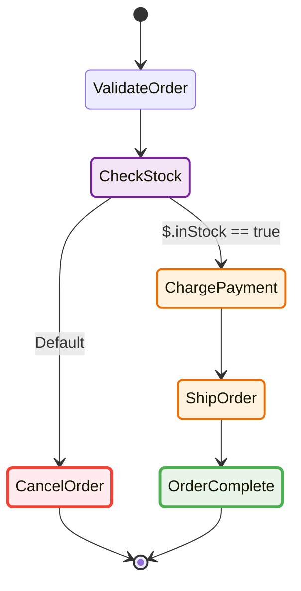

There's no shortage of ways to look at a state machine — this is where sfn-diagram fits versus the other two most common options:

| | **sfn-diagram** | AWS Console visualizer | Mermaid Live Editor |
|---|---|---|---|
| Input | ASL, CloudFormation/SAM/CDK templates, live AWS state machines | Deployed state machine only | Manual Mermaid you write by hand |
| Output | SVG, Mermaid, PNG, interactive HTML | Static graph in-browser | Mermaid diagram only |
| CI / PR integration | [GitHub Action](/ecosystem/github-action/) posts a diff overlay on every PR that touches ASL | None | None |
| Execution overlays | Paints a real run's path/status/duration onto the diagram | Basic per-execution highlighting, console-only | Not applicable |
| Runs where | CLI, Node, browser, edge runtimes | AWS Console only | Web app only |
| Automation | Full programmatic API (`generateSvg`, `generateMermaid`, etc.) | None — UI only | None — UI only |

In short: reach for the AWS Console visualizer to eyeball a state machine you already deployed, reach for Mermaid Live if you're hand-drawing a diagram from scratch — reach for sfn-diagram when you want diagrams generated automatically from your actual definition, checked into CI, and diffed on every pull request.

## Features

- **Multiple Output Formats**: SVG (D3.js), Mermaid syntax, and PNG
- **Automatic Layout**: Smart graph positioning using Dagre layout engine
- **Full ASL Support**: All state types (Pass, Task, Choice, Wait, Succeed, Fail, Parallel, Map), both JSONPath and JSONata query languages, plus `Catch`/`Retry` rendering
- **Modern ASL**: Variables (`Assign`) shown per state, and Distributed Map rendered distinctly from an inline Map — including its `MaxConcurrency`, `ItemReader` source, and `ResultWriter` sink
- **Visual Diffing**: Compare two definitions and highlight added / modified / removed states — drives the PR-preview GitHub Action
- **Execution Overlays**: Paint a real execution's history onto the diagram — succeeded/failed/caught/not-reached states, the taken path, and per-state duration & retry counts
- **Customizable Themes**: AWS light/dark themes plus custom theme support
- **Flexible Layouts**: Top-bottom, left-right, right-left, bottom-top
- **Type-Safe**: Full TypeScript support with comprehensive type definitions
- **AWS SDK Integration**: Direct integration with AWS Step Functions API
- **Dual APIs**: Function-based and class-based interfaces
- **Runs Anywhere**: SVG and Mermaid generation has zero platform dependencies — works in Node, the browser, and edge runtimes

## What it looks like

Give it an ASL definition like this order-processing workflow ([`examples/order-processing.asl.json`](https://github.com/yusufaf/sfn-diagram/blob/main/examples/order-processing.asl.json)):

```jsonc
{
  "StartAt": "ValidateOrder",
  "States": {
    "ValidateOrder": { "Type": "Pass", "Next": "CheckStock" },
    "CheckStock": {
      "Type": "Choice",
      "Choices": [{ "Variable": "$.inStock", "BooleanEquals": true, "Next": "ChargePayment" }],
      "Default": "CancelOrder"
    },
    "ChargePayment": { "Type": "Task", "Resource": "arn:aws:lambda:...:charge-payment", "Next": "ShipOrder" },
    "ShipOrder":     { "Type": "Task", "Resource": "arn:aws:lambda:...:ship-order", "Next": "OrderComplete" },
    "CancelOrder":   { "Type": "Fail", "Error": "OutOfStock" },
    "OrderComplete": { "Type": "Succeed" }
  }
}
```

…and `generateMermaid` turns it into Mermaid source. Paste it anywhere Mermaid renders — GitHub comments and READMEs do so inline — or feed the same definition to `generateSvg` and `exportPng` instead:


